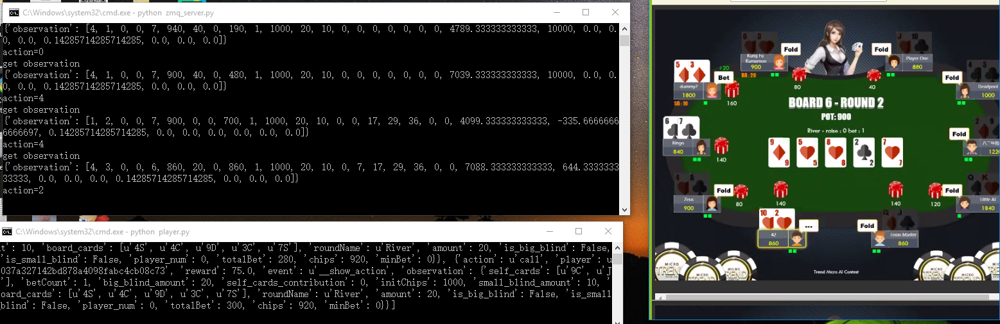

pokerAI
=======

A Texas Hold 'Em AI utilizing by reinforcement learning

# Environment

* python 2.7 for `player.py` (game agent, deuces related, random forest for reward predicting)
* python 3.5 for `zmq_server.py` (DQN tensorflow related)
* sklearn for py2.7
* tensorflow for py3.5
* zmq for py2 & py3

# How to run

* Run below steps at python 2.7
   * collect data by `util.py` at gaming as log1.txt, log2.txt
   * generate dataset by `log_to_dataset.py`
   * train model-1(predict reward) by `train_model_1.py`, this model helps you predict the `reward`
   * run game agent `player.py`

* Then, run below steps at python 3.5
   * run DQN server `zmq_server.py`

   
# Why and how the 2 part of code worked?

* since poker game related modules such as deuces not support python3, and DQN related modules tensorflow not support python2
* they communicated by zmq. agent send cmd and data to server, server reply DQN predicted action.

# Reinforcement learning & Random Forest observation & reward

* reward is predicted by random forest: currently we have get acc=86%
* 29 features at `util.py`
   * action (1~7)
   * round name (1/2/3...)
   * is_big_blind
   * is_small_blind
   * player_num
   * chips
   * amount
   * minBet
   * totalBet
   * betCount
   * initChips
   * big_blind_amount
   * small_blind_amount
   * board_cards
   * self_cards
   * card_score
   * my_card_contribution
   * other players action statistic
* observation
   * features not include action   (0)
* reward
   * winners actions are 1, else 0
   * hard to define reward for each action, so train RandomForest model to do this work

   
# Texas holdem platform protocal

* details:
   * [trend_texas_poker_rules](assets/trend_texas_poker_rules.pdf)
   * [trend_texas_ws_rules](assets/trend_texas_ws_rules.pdf)

# real-time game playing pictures

